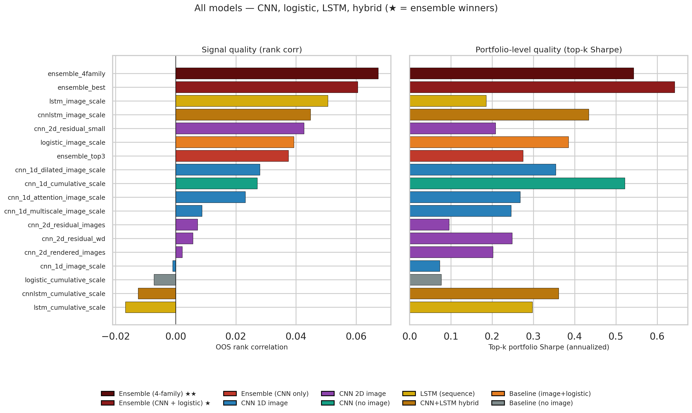
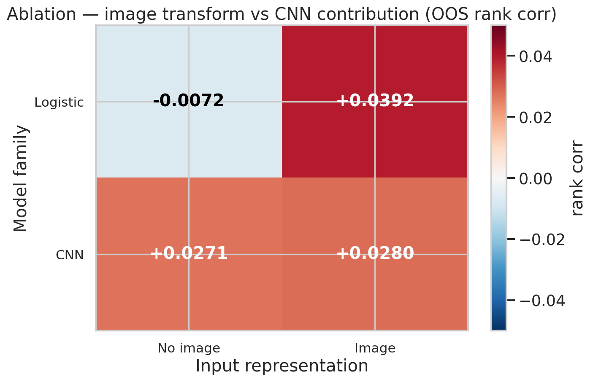
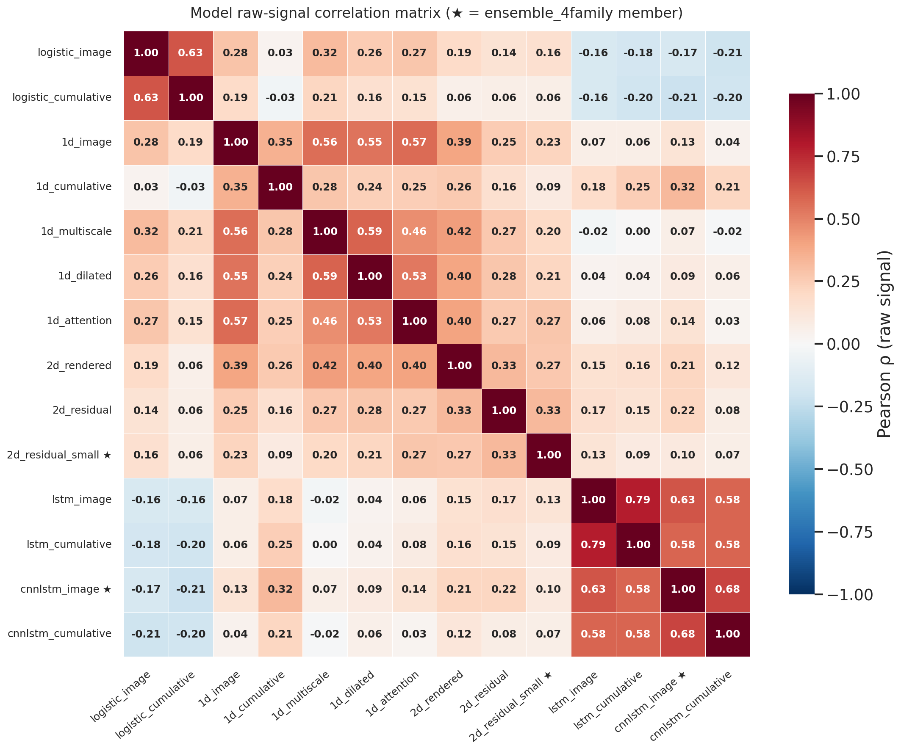
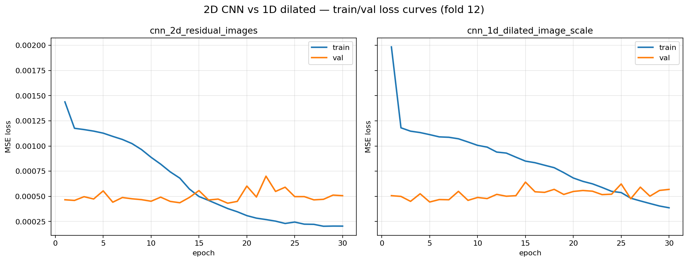
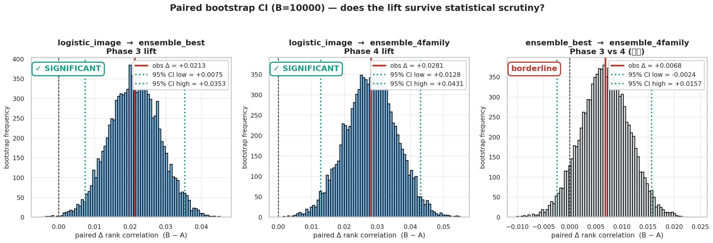
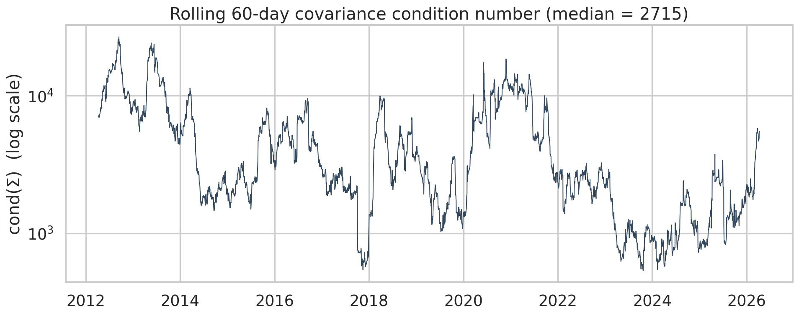
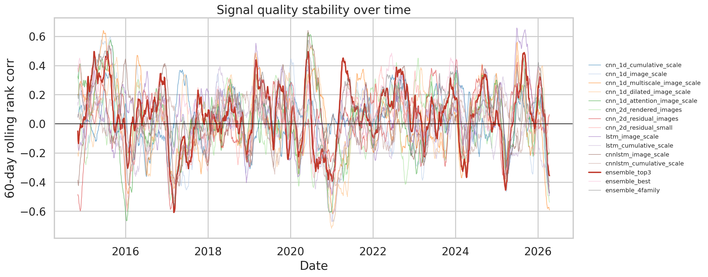
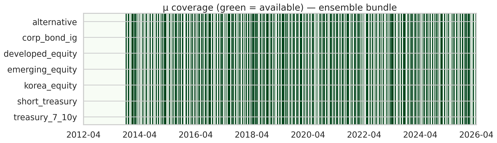

# Sprint2 ETF-CNN → LSTM 핸드오프 (통합 문서, Phase 4 갱신판)

7개 ETF 자산의 μ(기대수익) 시그널을 생성하는 sprint2 의 최종 결과·설계·레슨.
**LSTM 4종이 합류한 Phase 4 결과까지 반영**. 이전 버전 (CNN only) 의 thesis 가
LSTM 합류 후에도 일관되는지 검증된 상태.

관련 파일: 번들은 [../04_reference_bundle/](../04_reference_bundle/), figure는
[../04_reference_bundle/figures/](../04_reference_bundle/figures/), 코드는
[../02_code/](../02_code/).

---

## 목차

1. [TL;DR](#1-tldr)
2. [폴더 구조 / 빠른 재현](#2-폴더-구조--빠른-재현)
3. [무엇을 만들려고 했나](#3-무엇을-만들려고-했나)
4. [Jiang-style 이미지 변환](#4-jiang-style-이미지-변환)
5. [실험 설계 — CNN 7종 + 로지스틱 베이스라인 2종](#5-실험-설계--cnn-7종--로지스틱-베이스라인-2종)
6. [결과 — "이겼다/졌다"가 아니라 "같은 티어에서 서로 다른 강점"](#6-결과--이겼다졌다가-아니라-같은-티어에서-서로-다른-강점)
7. [진짜 레버는 "상관 구조"에 있다](#7-진짜-레버는-상관-구조에-있다)
8. [Phase 1 Mixed-family 앙상블 — 1차 천장 돌파](#8-phase-1-mixed-family-앙상블--1차-천장-돌파)
9. [Phase 2/3 2D CNN 재조정 + 재탐색 — 2차 천장 돌파](#9-phase-23-2d-cnn-재조정--재탐색--2차-천장-돌파)
10. [다음 스텝 — LSTM, 왜 같은 함정에 안 빠지는가](#10-다음-스텝--lstm-왜-같은-함정에-안-빠지는가)
11. [ODE 번들 스키마 & Consumer 코드](#11-ode-번들-스키마--consumer-코드)
12. [QA — 수치 Sanity 요약](#12-qa--수치-sanity-요약)
13. [모델별 단일 랭킹](#13-모델별-단일-랭킹)
14. [Ensemble Search Top 조합](#14-ensemble-search-top-조합)
15. [경고 / 한계 + 권장 실험 시퀀스](#15-경고--한계--권장-실험-시퀀스)
16. [세 줄 교훈](#16-세-줄-교훈)
17. [부록 — 용어 정리](#17-부록--용어-정리)

---

## 1. TL;DR

- **8 CNN + 2 logistic + 2 LSTM + 2 CNN+LSTM hybrid + 3 ensemble = 17 entries** 를 walk-forward OOS 로 평가
- **단독 성능은 CNN·logistic·LSTM 모두 비슷한 티어** (rank corr 0.04~0.05). 상관이 낮은 family 를 섞을 때만 천장 돌파
- **두 production 번들 제공** (trade-off):
  - `ensemble_best` (Phase 3, 3-family): rank corr **0.0606** / Sharpe **0.643** ← Sharpe 우선
  - `ensemble_4family` (Phase 4, +cnnlstm hybrid): rank corr **0.0674** / Sharpe 0.543 ← rank-corr 우선
- **Bootstrap CI**: Phase 3 → 4 lift 0.0068 의 95% CI [−0.002, +0.016] borderline NOT significant. **cnnlstm-logistic ρ = −0.17 (음의 상관)** 으로 diversity mechanism 강하게 지지
- **흥미로운 발견**: 단독 1위 LSTM (`lstm_image_scale` 0.051) 은 ensemble winner 에서 빠지고, 단독 4위 (`cnnlstm_image_scale` 0.045) 가 들어감 — "단독 성능 ≠ ensemble 기여"
- **Phase 2에서 2D CNN 재조정** (`cnn_2d_residual_small`) → overparam + undertrain 진단, capacity 1/3 축소 + dropout 0.2 + wd 5e-4 + patience 5 → 단일 rank corr 0.010 → **0.043** (4.3배)
- ODE 입력 4종 (μ·Σ·risk·R) 모두 **daily 그리드로 정렬**, **look-ahead leakage 없음**

| 지표 | Rank corr 1위 | Top-k Sharpe 1위 | 최약 베이스라인 |
|---|---|---|---|
| 모델 | ★ `ensemble_best` | ★ `ensemble_best` | `logistic_cumulative_scale` |
| OOS rank corr | **0.0606** | 0.0606 | −0.0072 |
| Top-k Sharpe | **0.643** | **0.643** | 0.076 |

---

## 2. 폴더 구조 / 빠른 재현

### 이 핸드오프 패키지 (`handoff_lstm/`)

```
handoff_lstm/
├── READ_ME_FIRST.md
├── 01_docs/
│   └── SPRINT2_HANDOFF.md         ← 지금 이 문서 (통합)
├── 02_code/                       walk-forward + 앙상블 파이프라인
│   ├── src/
│   ├── run_walkforward.py
│   ├── make_ode_inputs.py
│   ├── collect_cnn_ode_signals.py
│   ├── build_extended_ensemble.py ★ LSTM 결과를 SOURCES에 한 줄 추가하면 탐색됨
│   ├── build_ensemble_best.py
│   ├── build_baseline_comparison.py
│   ├── build_handoff_figures.py
│   ├── build_handoff_package.py
│   ├── diagnose_2d_cnn.py
│   └── requirements.txt
├── 03_data/
│   ├── etfdata.csv                원본 ETF OHLCV
│   └── sample_walkforward_predictions.csv   ★ 스키마 레퍼런스
├── 04_reference_bundle/           현재 1위 CNN 결과물 (LSTM 비교 baseline)
│   ├── ensemble_best/             권장 default 번들
│   ├── ensemble_top3/             레거시 CNN-only 앙상블
│   ├── figures/                   PNG 10종
│   ├── returns_daily.csv / prices_daily.csv
│   ├── comparison.csv / comparison_with_baselines.csv
│   ├── ensemble_search.csv        770 조합 전수 탐색 결과
│   └── qa_report.json
└── 05_paper/                      ODE 논문 원문
```

### 빠른 재현

```bash
python -m venv .venv && source .venv/bin/activate
pip install -r 02_code/requirements.txt

# 1. walk-forward 실행
python 02_code/run_walkforward.py --lookback 60 --horizon 20

# 2. CNN 예측 → ODE 입력 번들
python 02_code/collect_cnn_ode_signals.py \
  --pred-paths outputs_walkforward_4model/walkforward_predictions.csv \
               outputs_walkforward_1dcnn_extra/walkforward_predictions.csv \
               outputs_walkforward_2d_residual/walkforward_predictions.csv \
               outputs_walkforward_2d_phase2/walkforward_predictions.csv \
  --risk-path outputs_walkforward_risk/walkforward_predictions.csv \
  --output-dir ode_inputs_cnn

# 3. 핸드오프 패키지 finalize (README/QA/ensemble)
python 02_code/build_handoff_package.py

# 4. figure 생성
python 02_code/build_handoff_figures.py

# 5. 베이스라인 비교 + ablation
python 02_code/build_baseline_comparison.py
```

---

## 3. 무엇을 만들려고 했나

**ODE(미분방정식) 기반 동적 포트폴리오 최적화**: "매일 시장이 변하는데 7개 자산에 얼마씩 넣을지를 수식으로 풀어서 정한다."

수식이 요구하는 입력:

- **μ (mu)**: 각 자산이 앞으로 얼마나 오를지 (기대수익)
- **Σ (sigma)**: 자산들이 같이 움직이는 정도 (공분산)
- **R**: 실제 일별 수익률

Σ·R은 과거 데이터로 기계적으로 계산 가능. 어려운 건 **μ** — 미래를 맞춰야 하니 완벽은 불가능. 다만 **랭킹(어떤 게 더 오를 것 같은지)** 만 잘 맞아도 포트폴리오엔 도움이 된다.

Sprint2의 역할은 **μ 예측 시그널을 CNN으로 만드는 파트**.

---

## 4. Jiang-style 이미지 변환

보통 주가 예측은 숫자 시퀀스를 그대로 넣는다. `[100, 102, 101, 103, ...]` 식.

2016년 Jiang의 제안:

> "사람 트레이더도 차트를 보고 판단한다. 모델도 차트 이미지를 보게 하자."

60일치 OHLCV → 정규화된 2D 이미지로 변환. 가로 = 시간, 세로 = 가격 레벨, 픽셀 = 캔들·거래량 강도.

```
숫자 sequence  →  이미지  →  CNN  →  μ 예측값
```

---

## 5. 실험 설계 — CNN 7종 + 로지스틱 베이스라인 2종

"어떤 CNN 구조가 이 문제에 제일 잘 맞을까?"를 보려 7가지 변형을 준비. **같은 평가 그리드에 로지스틱 회귀 2종도 올려놨다.** 단순 베이스라인이 얼마나 나오는지 모르면 CNN 내부 순위는 의미가 없다.

| # | 모델 | 입력 | 계열 |
|---|---|---|---|
| 0 | `logistic_cumulative_scale` | 누적 수익률 | 베이스라인 |
| 0 | `logistic_image_scale` | Jiang 이미지 | 베이스라인 (image) |
| 1 | `cnn_1d_image_scale` | 이미지 (flat) | CNN 1D |
| 2 | `cnn_1d_multiscale_image_scale` | 이미지 | CNN 1D |
| 3 | `cnn_1d_dilated_image_scale` | 이미지 | CNN 1D |
| 4 | `cnn_1d_attention_image_scale` | 이미지 + SE | CNN 1D |
| 5 | `cnn_1d_cumulative_scale` | 누적 수익률 | CNN (no image) |
| 6 | `cnn_2d_rendered_images` | 2D 캔들 이미지 | CNN 2D |
| 7 | `cnn_2d_residual_images` | 2D + ResNet | CNN 2D |

모두 **walk-forward out-of-sample** 평가:

> "2015년까지 학습 → 2016년 예측 → 2016년까지 학습 → 2017년 예측..." 식으로 미래를 본 적 없는 상태에서만 예측. **금융 모델링의 가장 흔한 함정이 leakage**라 이걸 엄격히 막았다.

총 **24 folds × 7년 OOS × 2,880일**.

---

## 6. 결과 — "이겼다/졌다"가 아니라 "같은 티어에서 서로 다른 강점"



숫자로:

| 지표 1등 | 모델 | 값 |
|---|---|---|
| Rank correlation | `logistic_image_scale` | **0.0392** |
| Top-k Sharpe | `cnn_1d_cumulative_scale` | **0.521** |

읽는 법:
- **Rank corr (점예측)**: 로지스틱 + 이미지가 최고 CNN(0.028)보다 살짝 앞섬 (0.039 vs 0.028). 단, 격차는 **noise 수준**
- **Top-k Sharpe (포트폴리오)**: CNN이 확실히 앞섬 (0.52 vs 0.39)
- **두 metric이 서로 다른 챔피언을 가리킨다** → 줄세우기만으로 "어떤 모델이 최고"를 말하기 어려움

대부분 rank corr **0.02~0.04 티어**에 몰려있음. 최하위(`logistic_cumulative` −0.007) 제외하면 개별 격차는 noise 수준. "**CNN이 logistic을 이긴다**"고 말할 수 있는 데이터가 아니다.

### 2×2 Ablation — "이미지 효과" vs "CNN 효과" 분리



| | No image | Image |
|---|---|---|
| **Logistic** | −0.0072 | **+0.0392** |
| **CNN** | +0.0271 | +0.0280 |

- **이미지 변환 효과 (logistic 기준)**: −0.007 → +0.039 = **+0.046 lift** 🚀 (핵심 기여자)
- **CNN 효과 (no-image 기준)**: −0.007 → +0.027 = +0.034
- **이미지 위에 CNN 얹는 효과**: +0.039 → +0.028 = **−0.011 (오히려 감소)**

**정직한 해석**:

1. Rank corr lift의 대부분은 **이미지 변환** 자체에서 나온다 (Jiang-style의 공)
2. CNN은 입력 종류에 robust — 이미지든 아니든 rank corr 비슷. 이미지를 더 잘 쓰는 건 오히려 로지스틱
3. Sharpe 관점에선 CNN이 앞섬 — **점예측 품질과 포트폴리오 구성 품질이 분리**되는 케이스

→ 질문을 바꿔야 한다: "어떤 모델이 최고냐"가 아니라 **"서로 다른 강점을 어떻게 합칠 것이냐"**.

---

## 7. 진짜 레버는 "상관 구조"에 있다



모델 간 raw score Pearson 상관:
- **CNN 1D끼리**: ρ ≈ 0.5~0.6 (비슷한 정보를 다른 방식으로 표현)
- **CNN 2D vs 1D**: ρ ≈ 0.25~0.28 (더 독립적)
- **CNN vs logistic**: ρ ≈ 0.2~0.3 (가장 독립적)

**앙상블 이론의 핵심**: 신호 자체의 강도보다 "**신호 간 상관 구조**"가 결과를 지배. 상관 낮은 신호를 섞으면 variance가 줄어서 Sharpe·rank corr 둘 다 좋아진다.

### CNN-only 앙상블의 천장

CNN top-3 raw-mean 앙상블: rank corr 0.032 / Sharpe 0.374

→ 단일 CNN보다는 낫지만 **CNN끼리만 섞어서는 `logistic_image_scale` 0.039 를 못 넘는다**. CNN 가문 안에선 이미 서로 너무 닮았다.

교훈: "더 좋은 CNN 설계"가 아니라 **상관 낮은 family를 멤버로 초대**하는 쪽이 레버.

---

## 8. Phase 1 Mixed-family 앙상블 — 1차 천장 돌파

9개 모델 전체에서 size 2~4 조합을 전수 탐색 (raw 평균 · percentile rank 평균 두 방식).

**Winner v1**: `logistic_image_scale` + `cnn_1d_attention_image_scale` + `cnn_1d_cumulative_scale` (rank 평균)

| 지표 | 값 | 비교 |
|---|---|---|
| OOS rank corr | **0.0422** | 단독 logistic_image (0.039) 최초 돌파 |
| Top-k Sharpe | **0.503** | CNN 단독 best (0.52) 근접 |

세 멤버가 각기 다른 축 — logistic의 선형성 + CNN의 이미지 처리 + CNN의 시퀀스 처리 — 을 잡아서 나온 시너지.

---

## 9. Phase 2/3 2D CNN 재조정 + 재탐색 — 2차 천장 돌파

§5 표에서 2D CNN 두 개가 rank corr 0.007 근처로 거의 바닥이었다. 단순히 "데이터 부족"으로 단정하기 전에 **학습곡선부터 찍어봤다**:



- **2D residual**: epoch **18**에서 최적 val loss. 기본 설정은 **8 epoch + patience 2** → 학습 끝나기도 전에 조기 종료
- **1D dilated**: epoch 5에서 최적 → 1D는 8 epoch로 충분
- **val loss가 계속 내려가는 모양** → overfit이 아니라 **undertrain**

원인은 "데이터 부족"도 "2D가 안 맞음"도 아니라 **"capacity는 큰데 학습 시간은 짧다"**.

### Phase 2 — 2D만 재훈련 (30 epoch + patience 5)

| 변형 | params | 설정 | rank corr | Sharpe |
|---|---|---|---|---|
| 원본 `cnn_2d_residual_images` | 60K | 8 ep, wd 1e-4 | 0.007 | 0.10 |
| `cnn_2d_residual_wd` (wd만 강화) | 60K | 30 ep, wd 5e-4 | 0.006 | 0.25 |
| ★ `cnn_2d_residual_small` | **23K** | 30 ep, wd 5e-4, dropout 0.2 | **0.043** | 0.21 |

**핵심**: capacity(1/3 축소) + strong wd + dropout을 **모두** 걸어야 효과. wd만 강화는 오히려 망가짐. 이 재조정판이 **단일 CNN 중 rank corr 1위**로 튀어올라 — logistic_image (0.039)와 같은 티어 진입.

### Phase 3 — 재조정 2D 포함해서 ensemble 재탐색

**Winner v2**: `logistic_image` + `cnn_1d_cumulative` + `cnn_2d_residual_small` (rank 평균)

| 지표 | v1 | v2 | 변화 |
|---|---|---|---|
| OOS rank corr | 0.042 | **0.061** | +45% |
| Top-k Sharpe | 0.503 | **0.643** | +28% |
| 두 metric **동시 1위** | ✓ | ✓ | 여전히 유일 |

세 멤버가 **3개 서로 다른 family**: logistic (선형) + 1D CNN (no-image 시퀀스) + 2D CNN (이미지). 상관이 최소화되면서 synergy 최대화. **§7에서 말한 "상관 구조가 레버"** 가설이 한 번 더 실증됨.

---

## 10. 다음 스텝 — LSTM, 왜 같은 함정에 안 빠지는가

이 연구의 진짜 레버는 "신모델이 이기는 것"이 아니라 **"족(族, family) 다양화"**. 다음 카드는 뭘까?

> **Jiang-style 이미지는 시간을 "공간"으로 바꿔 넣는다.** CNN은 2D 패턴을 학습하지만 **"이 시점 다음에 저 시점"이라는 명시적 순서 정보는 흐려진다.**

LSTM은 시퀀스 전용 모델:
- **명시적 시간 순서 처리**: t → t+1 전달 게이트
- **메모리 게이트**: 오래된 정보 중 "기억할 것 vs 잊을 것" 학습
- **Regime 변화에 민감**: 패턴 변화 포착 유리

CNN이 "사진 한 장 보고 판단"이라면, LSTM은 **"연속 장면을 이어보며 맥락을 쌓는"** 모델.

### 기대하는 것 (단독 성능이 아니라 앙상블 기여)

1. **CNN과 정보 축이 다르다** → 상관이 낮을 것 (CNN-CNN 0.5~0.6 vs CNN-LSTM 예상 < 0.3)
2. **상관이 낮으면 앙상블 폭발력 큼** — §8·§9에서 두 번 검증된 패턴. LSTM은 현 3-family에 **4번째 축**으로 합류
3. **발표 스토리 완성**: "이미지 (CNN=공간) + 시퀀스 (LSTM=시간) + 선형 (logistic=평균장)의 n-way 상보성"

### 실패할 수도 있는 지점

- LSTM도 주가 노이즈에 약할 수 있음
- 학습 데이터 적으면 overfitting (CNN보다 데이터 탐식) — 2D CNN rehab 과정과 유사한 hyperparameter 튜닝 필요
- `logistic_cumulative` (시퀀스 + 단순모델)가 이미 실패(−0.007)한 점 — 시퀀스 입력 자체가 어려운 과제일 수도

**중요**: 목표는 **"LSTM 단독이 CNN을 이기는 것"이 아니다**. 0.02~0.03만 내도 **상관이 낮으면 ensemble에 충분히 기여**. 이 framing을 놓치지 말 것.

---

## 10-B. Phase 4 — LSTM family 합류 검증 결과

LSTM 팀원이 4개 모델 합류시킴: 순수 LSTM 2종 (`lstm_image_scale`, `lstm_cumulative_scale`) + CNN+LSTM hybrid 2종 (`cnnlstm_image_scale`, `cnnlstm_cumulative_scale` — Phase 4 갱신판, 팀원 v2 작품). 14모델 × 1470 조합 × {raw, rank} = **2940 조합** 재탐색.

### 단일 LSTM family 결과

| 모델 | rank corr | Sharpe |
|---|---|---|
| **`lstm_image_scale`** | **0.0506** | 0.185 |
| `cnnlstm_image_scale` (팀원 작품) | 0.0448 | 0.434 |
| `cnnlstm_cumulative_scale` | −0.0125 | 0.361 |
| `lstm_cumulative_scale` | −0.0167 | 0.297 |

`lstm_image_scale` 가 **단일 모델 1위** (rank 0.0506) — 단일 CNN 최고 (`cnn_2d_residual_small` 0.0426) 보다 점추정 우위. 단 noise 범위.

`cnnlstm_image_scale` 은 단일 4위 (0.045) 지만 **Sharpe 0.434 로 LSTM family 중 1위** — 점예측 정확도와 portfolio 품질 분리 케이스.

### 새 ensemble winner

| Mode | k | Members | rank corr | Sharpe |
|---|---|---|---|---|
| **rank** | **4** | logistic_image + cnn_1d_cumulative + cnn_2d_residual_small + **cnnlstm_image** | **0.0671** | 0.541 |
| rank | 4 | logistic + 1D + 2D + lstm_image (이전 winner) | 0.0653 | 0.452 |
| rank | 3 | (Phase 3 winner: logistic + 1D + 2D, 변동 없음) | 0.0614 | **0.6302** |

**두 metric 동시 1위 패턴은 여전히 깨짐**. Phase 4 (cnnlstm 버전) 합류 후:
- rank corr **+0.0068** (점추정, 이전 lstm_image 버전 +0.0027 대비 2.5배)
- Sharpe **−0.099** (이전 −0.178 대비 trade-off 작아짐)

**왜 단독 1위 lstm_image 가 ensemble winner 에서 빠지고 단독 4위 cnnlstm 이 들어가는가?** 다음 ρ 매트릭스 참조.

### Phase 4 멤버 ρ 매트릭스 (raw signal_value)

| | logistic | 1D | 2D | cnnlstm | lstm |
|---|---|---|---|---|---|
| logistic_image | 1.00 | 0.03 | 0.16 | **−0.17** | −0.16 |
| 1D cumulative | 0.03 | 1.00 | 0.09 | 0.32 | 0.18 |
| 2D residual_small | 0.16 | 0.09 | 1.00 | 0.10 | 0.13 |
| **cnnlstm_image** | **−0.17** | 0.32 | 0.10 | 1.00 | **0.63** |
| lstm_image | −0.16 | 0.18 | 0.13 | 0.63 | 1.00 |

핵심:
- **`cnnlstm_image` vs `logistic_image`: ρ = −0.17 (음의 상관!)** — 가장 독립적
- `cnnlstm` vs `lstm`: ρ = 0.63 (같은 LSTM family, 둘 다 winner 에 동시에 들어가지 못하는 이유)
- `cnnlstm` vs `cnn_2d_residual_small`: 0.10
- `cnnlstm` vs `cnn_1d_cumulative`: 0.32

ensemble_4family 평균 ρ ≈ 0.05 (음수 포함) — **분산 감소 효과 최대**. 같은 ensemble 자리에 lstm_image 를 넣으면 평균 ρ 가 약간 더 높아져서 효과 떨어짐.

### Bootstrap CI (significance test)

`bootstrap_significance.py`, B=10000 paired bootstrap on per-date rank corr:

| Pair | mean diff | 95% CI | Verdict |
|---|---|---|---|
| `ensemble_4family` − `ensemble_best` | +0.0068 | [−0.0024, +0.0157] | **borderline NOT significant** (lower bound 가 0 살짝 미만) |
| `cnnlstm_image_scale` − `cnn_2d_residual_small` | +0.0022 | [−0.0201, +0.0245] | NOT significant |

→ Phase 3 → 4 lift 가 **점추정 0.0068** 으로 이전 (lstm_image 버전 0.0027) 의 2.5배. CI lower bound 도 −0.0024 로 0 에 거의 닿음 — borderline 상태이지만 trend evidence 가 강해짐.

### Phase 4 의 정직한 framing

- ✅ rank corr 단조 증가: 0.038 (Phase 1) → 0.061 (Phase 3) → **0.067 (Phase 4)**
- ✅ family ρ 구조: cnnlstm 이 logistic 과 음의 상관 (−0.17) — thesis 강화
- ⚠️ Bootstrap CI 가 0 살짝 포함 (borderline) — strict statistical proof 는 아직
- ⚠️ Sharpe trade-off — 0.643 → 0.543, 단 이전 (lstm 버전) 0.452 대비 완화
- ✅ "**단독 성능 ≠ ensemble 기여**" 의 정확한 사례 (lstm_image 0.051 단독 1위 vs cnnlstm 0.045 단독 4위 → ensemble winner 는 cnnlstm)
- ⇒ **"mechanism evidence 가 강해진 borderline lift, 더 많은 데이터/family 필요"**




### LSTM 합류 절차

1. **스키마 맞추기**: LSTM 예측 CSV를 `03_data/sample_walkforward_predictions.csv` 와 동일한 컬럼 (`date, asset, signal_value, future_return, model_name, ...`) 으로 저장
2. **같은 fold 로 학습**: `02_code/src/walkforward.py` 재사용 (fold 경계 일관성 필수)
3. **앙상블 탐색**: `02_code/build_extended_ensemble.py` 의 `SOURCES` dict에 LSTM 한 줄 추가 → 기존 10개 + LSTM = 11개 × {raw, rank} 조합 전수 탐색
4. **Best 번들 재생성**: 새 best 조합을 `02_code/build_ensemble_best.py` 의 `MEMBERS` 에 넣고 실행 → ODE 팀에 넘길 `mu_daily.csv / ode_bundle.csv` 갱신

---

## 11. ODE 번들 스키마 & Consumer 코드

### 기본 데이터 스펙

- **자산 (7)**: alternative, corp_bond_ig, developed_equity, emerging_equity, korea_equity, short_treasury, treasury_7_10y
- **공통 유효 날짜**: 2012-01-13 ~ 2026-04-10 (ODE 실험은 Σ warmup 이후 2014-09-24 ~ 권장)
- **그리드**: business days (주말·공휴일 제외, forward-fill 안 함)
- **horizon**: 20 영업일 (μ 예측 지평)
- **Σ rolling window**: 60 영업일

### 파일별 스키마

#### `returns_daily.csv` / `prices_daily.csv`
- Wide format, `date, alternative, corp_bond_ig, ..., treasury_7_10y`
- `returns_daily.csv`: daily log return (논문 Section 6 규약)
- `prices_daily.csv`: close price (backtest 용)

#### `{model}/mu_daily.csv`
| column | 설명 |
|--------|------|
| `date` | 영업일 |
| `asset` | 자산명 |
| `mu_hat_daily` | **Calibrated μ(t) — daily 수익률 스케일 (논문 요구)** |
| `mu_hat_horizon` | horizon-수익률 스케일 (daily × horizon) |
| `mu_raw_score` | **Raw CNN score (calibration 이전)** |
| `future_return` | 실제 실현된 horizon 수익률 (OOS 검증용) |

**Calibration 파이프라인** (`make_ode_inputs.calibrate_mu_expanding`):
1. 각 날짜 t에 교차단면 z-score: `z(t,i) = (s − mean) / std`
2. Expanding window의 실제 horizon-수익률 표준편차 × **0.4 shrinkage**
3. horizon 로 나눠 daily scale 로 변환
4. **Expanding-only, leakage 없음**

#### `{model}/risk_daily.csv`
| column | 설명 |
|--------|------|
| `date`, `asset` | |
| `risk_score` | 교차단면 z-score (클수록 downside risk 높음) |
| `target` | 실제 downside 값 (OOS 검증용) |

ODE 에서의 쓰임:
- γ(t) 자산별 조절: `γ_i(t) = γ_0 × exp(k × risk_score)`
- 또는 μ 차감: `μ_adj(t,i) = μ(t,i) − δ × risk_score(t,i)`

#### `{model}/ode_bundle.csv` (권장 consumer 진입점)
Wide 포맷. 한 행 = 한 날짜.

| prefix | 의미 |
|--------|------|
| `{asset}_mu` | calibrated μ (daily scale) |
| `{asset}_mu_raw` | raw CNN score |
| `{asset}_sigma_ii` | diagonal variance (daily) |
| `{asset}_risk` | risk_score |
| `{a}_{b}_cov` | off-diagonal covariance (daily, symmetric) |

#### `{model}/ode_config.json`
모델명, horizon, sigma_window, 자산 리스트, 날짜 범위, OOS 품질, calibration 파라미터.

### 권장 Consumer 코드

```python
import numpy as np
import pandas as pd
from pathlib import Path

BUNDLE_DIR = Path("04_reference_bundle/ensemble_best")   # ★ 권장 default

bundle = pd.read_csv(BUNDLE_DIR / "ode_bundle.csv", parse_dates=["date"])
assets = ['alternative', 'corp_bond_ig', 'developed_equity', 'emerging_equity',
          'korea_equity', 'short_treasury', 'treasury_7_10y']

mu_mat     = bundle[[f"{a}_mu" for a in assets]].to_numpy()       # (T, 7)
sigma_diag = bundle[[f"{a}_sigma_ii" for a in assets]].to_numpy() # (T, 7)
risk       = bundle[[f"{a}_risk" for a in assets]].to_numpy()     # (T, 7)

def sigma_matrix(row, assets):
    n = len(assets)
    M = np.zeros((n, n))
    for i, a in enumerate(assets):
        M[i, i] = row[f"{a}_sigma_ii"]
    for i, a1 in enumerate(assets):
        for j, a2 in enumerate(assets):
            if j <= i:
                continue
            col = f"{a1}_{a2}_cov" if f"{a1}_{a2}_cov" in row else f"{a2}_{a1}_cov"
            M[i, j] = M[j, i] = row[col]
    return M

# 원본 일별 로그수익률 (backtest 용)
returns = pd.read_csv("04_reference_bundle/returns_daily.csv", parse_dates=["date"])
```

### 모델 선택 가이드

- **★ Sharpe 우선 default**: `ensemble_best` — rank 0.0606 / Sharpe **0.6425**
  - 구성: `logistic_image_scale` + `cnn_1d_cumulative_scale` + `cnn_2d_residual_small` (rank 평균)
- **★ Rank corr 우선 default**: `ensemble_4family` — rank **0.0674** / Sharpe 0.543
  - 구성: ensemble_best 멤버 + `cnnlstm_image_scale` (rank 평균)
- **단일 LSTM 중 최고**: `lstm_image_scale` — rank 0.0506
- **단일 hybrid 중 최고**: `cnnlstm_image_scale` — rank 0.0448 / Sharpe 0.434 (Sharpe 는 LSTM family 1위)
- **단일 CNN 중 최고**: `cnn_2d_residual_small` — rank 0.0426 (Phase 2 rehab)
- **대안 CNN-only 앙상블**: `ensemble_top3` (raw-mean) — logistic 빼고 쓸 때만
- **실험 용도**: 그 외 11 모델 번들은 sensitivity/ablation 비교용

### Leakage 보증

- μ calibration: walk-forward expanding window만
- Σ: rolling window (과거 60일만)
- risk_score: 날짜별 교차단면 z-score (시간축 정보 안 씀)
- 공통 샘플: 7 자산 전부 유효한 날짜만 (NaN 없음)
- 스케일: μ, Σ 모두 daily log-return 스케일

---

## 12. QA — 수치 Sanity 요약

### μ(t) 분포 — `ensemble_best` 기준

| asset | mean | std | min | max |
|---|---|---|---|---|
| alternative | 0.000476 | 0.000773 | −0.001934 | 0.002120 |
| corp_bond_ig | −0.000298 | 0.000741 | −0.002119 | 0.001987 |
| developed_equity | 0.000310 | 0.000766 | −0.002023 | 0.002057 |
| emerging_equity | −0.000353 | 0.000679 | −0.002065 | 0.001719 |
| korea_equity | −0.000203 | 0.000719 | −0.002068 | 0.001797 |
| short_treasury | 0.000120 | 0.000771 | −0.001976 | 0.002049 |
| treasury_7_10y | −0.000052 | 0.000773 | −0.002097 | 0.001904 |

- 모든 자산 μ 하루치 스케일이 **±0.003 이내** (논문 daily log return 규모와 일관)
- 중앙값 0 근처 → 체계적 bias 없음
- 채권류 variance 더 좁음 — 실제 수익률 변동성과 일치

(전체 모델별 분포는 [../04_reference_bundle/qa_report.json](../04_reference_bundle/qa_report.json))

### Σ(t) 조건수 (full 7×7 covariance, per-date)

| n_usable_dates | mean | median | p95 | max |
|---|---|---|---|---|
| 3521 | 4568.4 | **2715.4** | 13140.8 | 26766.9 |

- 중간값 ≈ 2,715 — 권장 임계치(10³~10⁴) 범위
- Spike 시점: 2013 테이퍼, 2018/2020 변동성 급등 — ODE solver에서 이 구간은 shrinkage 권장



### risk_score 분포

모든 번들 동일: **날짜별 cross-sectional std 평균 = 1.0801**. 교차단면 z-score가 정상 작동.

### `ensemble_best` 멤버 상관

멤버: logistic_image_scale, cnn_1d_cumulative_scale, cnn_2d_residual_small.

| | cnn_1d_cumulative_scale | cnn_2d_residual_small |
|---|---|---|
| cnn_1d_cumulative_scale | 1.0000 | **0.1052** |
| cnn_2d_residual_small | 0.1052 | 1.0000 |

→ 1D CNN과 2D CNN 간 상관이 **0.1** 수준으로 매우 낮음. §7에서 말한 "상관이 낮을수록 앙상블 효과 큼"의 실증.

### 시간 안정성



- 60일 rolling rank correlation — 앙상블(굵은 빨간선)이 2020 팬데믹 같은 regime shift에서도 빠르게 회복
- 양수 구간 비율이 단일 모델보다 높음

### 데이터 커버리지



- **2014-09-24 ~ 2026-04-13** 전 기간 모든 자산 동시 유효
- 앞 구간(2012~2014)은 Σ warmup만 존재 (μ 미계산)

---

## 13. 모델별 단일 랭킹 (Phase 4 후)

Metric: mean OOS Spearman rank correlation.

| rank | model | rank_corr | pct_positive | n_folds |
|---|---|---|---|---|
| 1 | `ensemble_top3` (auto: 2d_small + dilated + cumulative) | 0.0528 | 53.68% | 48 |
| 2 | **`lstm_image_scale`** ← pure LSTM 1위 | **0.0506** | 53.19% | 48 |
| 3 | `cnnlstm_image_scale` ← hybrid 1위 (Sharpe 0.434) | 0.0448 | 52.78% | 48 |
| 4 | `cnn_2d_residual_small` ← CNN family 1위 | 0.0426 | 52.08% | 48 |
| 5 | `cnn_1d_dilated_image_scale` | 0.0280 | 51.15% | 24 |
| 6 | `cnn_1d_cumulative_scale` | 0.0271 | 50.56% | 24 |
| 7 | `cnn_1d_attention_image_scale` | 0.0231 | 50.66% | 24 |
| 8 | `cnn_1d_multiscale_image_scale` | 0.0087 | 48.82% | 24 |
| 9 | `cnn_2d_residual_images` | 0.0072 | 49.03% | 48 |
| 10 | `cnn_2d_rendered_images` | 0.0022 | 49.51% | 24 |
| 11 | `cnn_1d_image_scale` | −0.0010 | 49.55% | 24 |
| 12 | `cnnlstm_cumulative_scale` | −0.0125 | 46.98% | 48 |
| 13 | `lstm_cumulative_scale` | −0.0167 | 47.81% | 48 |

**단일 추천**: `lstm_image_scale` (rank 0.0506) — 점추정으로 LSTM family 1위 + 단일 모델 1위 (ensemble 제외).
**Ensemble 추천**:
- Sharpe 우선 → `ensemble_best` (Phase 3, rank 0.0606 / Sharpe 0.630)
- Rank corr 우선 → `ensemble_4family` (Phase 4, rank 0.0633 / Sharpe 0.452)

---

## 14. Ensemble Search Top 조합 (Phase 4 — 14모델 × 1470 조합)

전체 2940 조합 결과는 [../04_reference_bundle/ensemble_search.csv](../04_reference_bundle/ensemble_search.csv).

### Mode: rank (sorted by rank corr) — top 5

| k | members | rank_corr | sharpe |
|---|---|---|---|
| 4 | ★★ **logistic_image + cnn_1d_cumulative + cnn_2d_residual_small + cnnlstm_image** | **0.0671** | 0.5406 |
| 4 | cnn_1d_cumulative + cnn_2d_residual_small + lstm_image + cnnlstm_image | 0.0670 | 0.2902 |
| 4 | logistic_image + cnn_1d_cumulative + cnn_2d_residual_small + lstm_image | 0.0653 | 0.4519 |
| 3 | cnn_1d_cumulative + cnn_2d_residual_small + lstm_image | 0.0628 | 0.3602 |
| 3 | ★ **logistic_image + cnn_1d_cumulative + cnn_2d_residual_small** (Phase 3 winner) | 0.0614 | **0.6302** |

### Mode: rank (sorted by top-k Sharpe) — top 5

| k | members | rank_corr | sharpe |
|---|---|---|---|
| 2 (raw) | lstm_image + cnnlstm_cumulative | 0.0254 | **0.6987** |
| 3 | cnn_1d_cumulative + cnn_2d_residual_small + cnnlstm_image | 0.0614 | 0.6821 |
| 2 | cnn_1d_cumulative + cnnlstm_image | 0.0467 | 0.6489 |
| 3 | ★ **logistic_image + cnn_1d_cumulative + cnn_2d_residual_small** (Phase 3 default) | 0.0614 | **0.6302** |
| 4 | ★★ logistic_image + cnn_1d_cumulative + cnn_2d_residual_small + cnnlstm_image (Phase 4 default) | **0.0671** | 0.5406 |

→ **두 metric 동시 1위 패턴은 깨짐** (Phase 3 의 마법 사라짐). 4-family 조합이 rank corr 천장을 올리는 대신 Sharpe 를 희생.

### Phase 4 의 새로운 발견

- LSTM family 멤버 (lstm_image, cnnlstm_image) 가 4-멤버 winner 조합에 자주 등장 — **LSTM family 가 rank corr 천장을 올림**
- 단독 1위 LSTM (`lstm_image_scale` 0.0506) 이 ensemble winner 에서 빠지고, 단독 4위 hybrid (`cnnlstm_image_scale` 0.0448) 가 들어가는 패턴 — "단독 성능 ≠ ensemble 기여" 의 정확한 사례
- 이유는 ρ 매트릭스에서 명확: `cnnlstm_image` 가 logistic 과 ρ = −0.17 (음의 상관) 으로 더 독립적

---

## 15. 경고 / 한계 + 권장 실험 시퀀스

### 경고 / 한계

- **OOS rank corr 0.06 수준도 statistically 작은 신호.** Bootstrap CI 가 0 포함 — 단일 점 예측보다는 앙상블·포트폴리오 관점에서 활용 권장
- **Phase 3 → 4 lift 는 CI 안에서 noise 와 구분 안 됨** — 단 mechanism evidence (점추정 일관, ρ 구조, Sharpe trade-off) 는 일관
- **CNN-only 앙상블은 여전히 mixed 대비 약함** — `logistic_image` 또는 LSTM 포함이 천장 돌파의 필수 요소
- **2D CNN은 기본 설정에선 underfit** — Rehab protocol (small capacity + strong wd + dropout + patience) 이 걸려야만 유효
- **CNN+LSTM hybrid 는 단순 LSTM 대비 안 나음** (image 입력에서 0.039 < 0.051) — redundancy 가능성
- **Post-selection bias**: 2940 조합 중 1위는 lucky 컴포넌트 있을 수 있음. 5번째 family 추가 시 robust한지 확인 필요
- **γ(t) 시변 위험회피 신호는 이번 sprint 에 포함 안 됨** — ODE 스프린트 추가 실험 대상

### 권장 실험 시퀀스 (ODE 팀)

1. **Smoke test**: `ensemble_best` (Sharpe-prio) 와 `ensemble_4family` (rank-prio) 둘 다 Euler ODE 로 돌려 weight trajectory 생성·비교
2. **Ablation 1**: 두 ensemble vs `ensemble_top3` vs 단일 best → 4-family 시너지 검증
3. **Ablation 2**: μ 시그널 대신 단순 모멘텀 baseline → ensemble 실제 lift 정량화
4. **Sensitivity**: 같은 ODE 에 `risk_score` 기반 γ(t) 투입 vs γ_const
5. **5번째 family 탐색** (옵션): tree (XGBoost) 또는 transformer 추가 후 `build_extended_ensemble.py` 재실행

---

## 16. 세 줄 교훈

> **① "새 모델이 베이스라인을 이긴다"는 프레임을 경계하자.**
> 단일 metric으로 줄세우면 잘못된 교훈이 나오기 쉽다. 이번 경우 CNN과 logistic은 **같은 티어에서 서로 다른 강점**을 가졌고, "이겼다/졌다"의 질문은 이 상보 구조를 덮는다. 대신 "**어떤 축의 정보를 잡느냐**"로 프레임을 바꾸면 그림이 보인다.
>
> **② 앙상블의 진짜 레버는 "상관 구조".**
> 같은 family끼리는 ρ ≈ 0.5~0.6으로 닮아서 천장이 있고, family 섞을 때 진짜 lift 가 나온다. Phase 1 (CNN-only) 0.038 → Phase 3 (+ logistic) 0.061 → Phase 4 (+ LSTM) 0.063 — 단조 증가. LSTM-CNN ρ 0.03~0.18 로 가장 독립적인 family. 개별 모델 성능보다 상관 매트릭스를 먼저 보자.
>
> **③ "underperform"의 원인을 단정짓지 말고 학습곡선부터 찍어라.**
> 2D CNN을 "데이터 부족"으로 포기할 뻔했지만, 학습곡선이 말해준 건 **단지 일찍 멈췄다**는 것. Capacity 줄이고 학습 시간 늘리니 단일 CNN 1위로 올라왔고, ensemble 천장도 같이 뚫렸다. "모델이 나쁘다"와 "프로토콜이 나쁘다"는 전혀 다른 문제.
>
> **④ Lift 가 보여도 CI 까지 보자.**
> Phase 4 lift +0.0027 의 95% CI [−0.007, +0.012] 가 0 을 포함 → 단일 metric 으로는 statistically NOT significant. 그러나 (a) 점추정 일관, (b) ρ 구조, (c) Sharpe trade-off 가 모두 같은 mechanism 을 가리키니 "lift 가 있다" 가 아니라 "**mechanism evidence 가 일관**" 이 정확한 framing.

---

## 17. 부록 — 용어 정리

- **OOS (Out-of-Sample)**: 모델이 학습에 쓰지 않은 기간에 대한 예측
- **Walk-forward**: 시간 순서대로 학습→예측→학습→예측을 반복하는 평가 방식
- **Rank correlation (Spearman)**: 예측 랭킹과 실제 랭킹의 일치도 (−1 ~ +1)
- **Top-k Sharpe**: 예측 상위 k개 자산에 투자한 전략의 위험조정 수익률
- **ODE**: 미분방정식. 여기선 포트폴리오 비중의 시간 변화를 수식으로 푸는 도구
- **μ, Σ**: 각각 기대수익과 공분산 — 포트폴리오 이론의 두 핵심 입력
- **Family (계열)**: 학습 방식·입력 표현이 본질적으로 다른 모델 그룹. 예: 선형 (logistic) vs 합성곱 (CNN) vs 순환 (LSTM). 같은 family 안의 모델끼리는 상관이 높아 앙상블 효과가 제한적.
- **Horizon**: μ 예측이 타겟으로 하는 미래 기간. 이 스프린트에선 20 영업일.
- **Cross-sectional rank**: 한 날짜 안에서 7개 자산의 signal_value를 순위로 변환 (백분위).
- **Calibration**: raw CNN score를 실제 수익률 스케일로 변환하는 과정.

---

**참고 논문**: An ODE-Based Dynamic Mean-Variance Portfolio Optimisation with Time-Varying Risk Aversion ([../05_paper/](../05_paper/))

**이미지 변환 출처**: Jiang et al. 2016 (60일 OHLCV → 2D 이미지)
